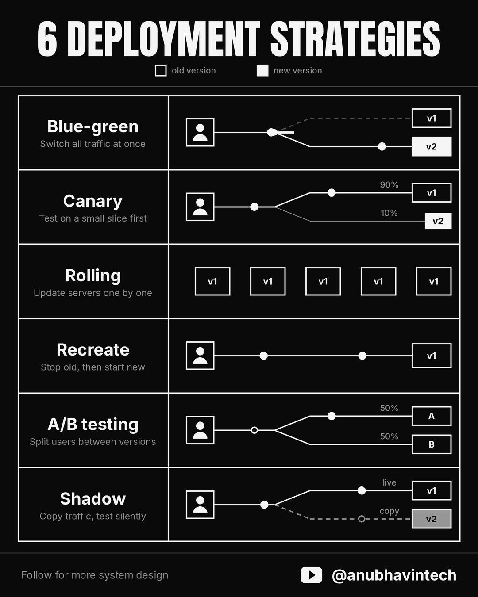

6 deployment strategies every engineer must know! 

Most outages don't come from bad code.

They come from how that code was shipped.

Here are 6 deployment strategies every engineer should know w

1. Blue-green

Run two identical setups. Users stay on the old one while the new one waits. Then you switch all traffic at once. If something breaks, switch back in seconds.

Trade-off: you pay for double the servers.

2. Canary

Send a small slice of users (say 10%) to the new version first. Watch errors and latency. If all looks good, slowly increase.

Great for catching bugs before everyone sees them.

3. Rolling

Update servers one by one while the rest keep serving users. No extra servers needed.

Catch: old and new versions run side by side for a while, so they must work together hence backward compatibility is must.

4. Recreate

Stop the old version fully, then start the new one.

Simplest option, but users face downtime. Fine for internal tools, risky for anything customer-facing.

5. A/B testing

Split users between two versions and compare results like clicks or sign-ups.

This one is less about safe releases and more about product decisions.

6. Shadow

Copy real traffic to the new version but throw away its responses. Users never see it.

Perfect for testing performance under real load with zero user risk.

Interview tip: when asked "how would you deploy this safely?", don't just name one. Talk about the trade-off between speed, cost and risk.

That's what interviewers want to hear.

![[Pasted image 20260926102545.png]]